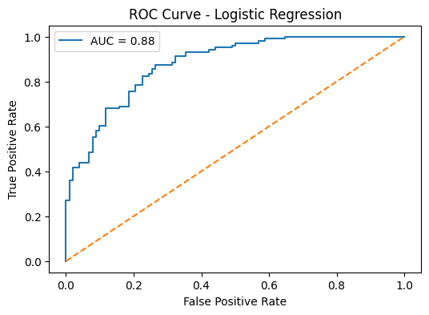
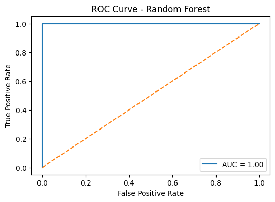
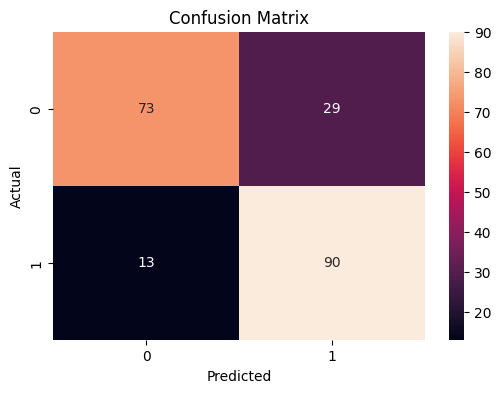
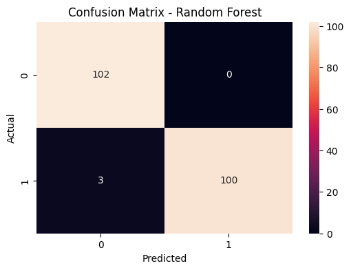
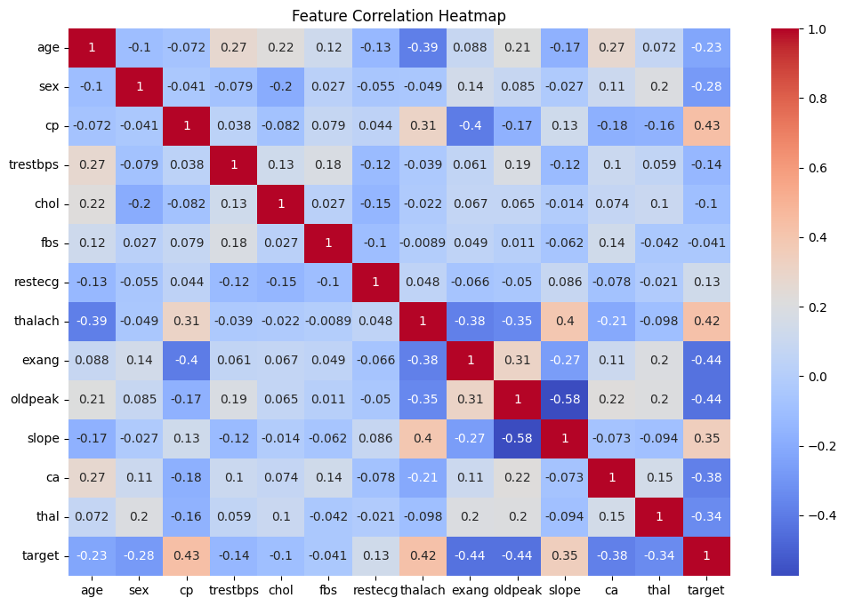
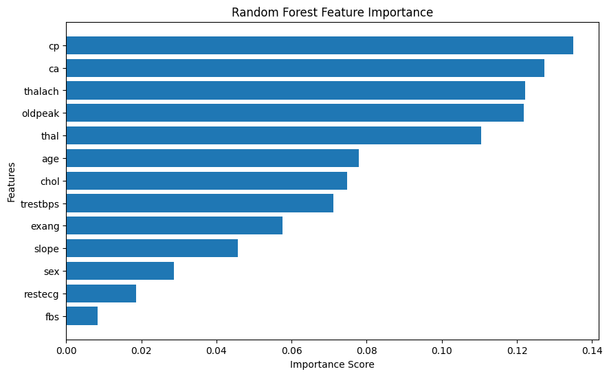
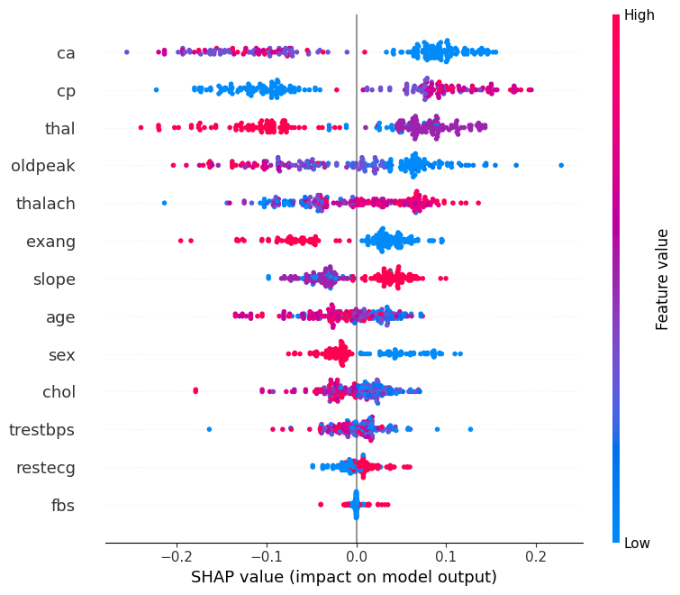
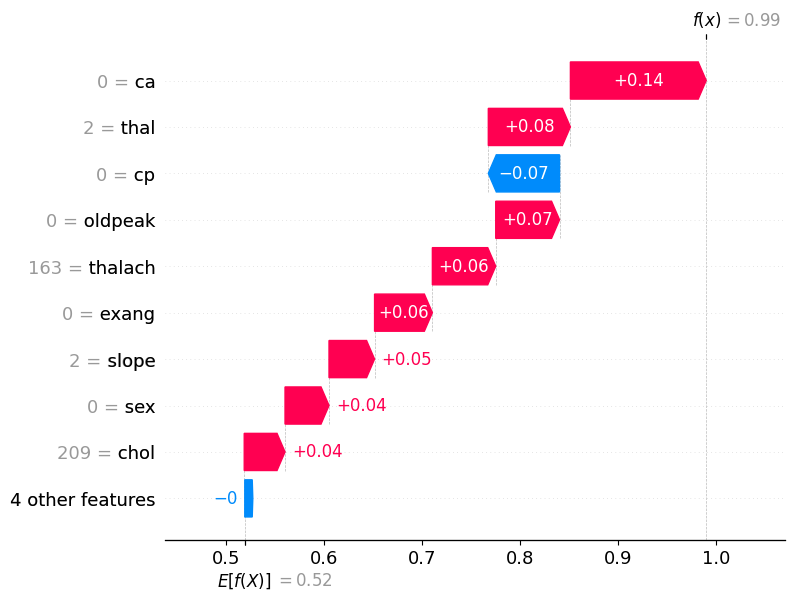

# Explainable Clinical Risk Prediction for Heart Disease

## Project Overview

This project investigates explainable clinical risk prediction for heart disease using interpretable statistical modelling and machine learning approaches.

The study compares Logistic Regression and Random Forest models for cardiovascular disease prediction while integrating Explainable Artificial Intelligence (XAI) techniques using SHAP (SHapley Additive exPlanations) to improve interpretability, transparency, and trustworthiness in healthcare AI systems.

The primary objective is to explore how interpretable machine learning can support transparent clinical decision-support systems.

---

## Dataset Description

The project uses the UCI Heart Disease dataset containing clinical and physiological variables associated with cardiovascular disease prediction.

### Clinical Features Included

- Age
- Sex
- Chest Pain Type (`cp`)
- Resting Blood Pressure (`trestbps`)
- Cholesterol (`chol`)
- Maximum Heart Rate (`thalach`)
- Exercise-Induced Angina (`exang`)
- ST Depression (`oldpeak`)
- Number of Major Vessels (`ca`)
- Thalassemia (`thal`)

### Target Variable

- `0` → No Heart Disease
- `1` → Presence of Heart Disease

---

## Technologies Used

- Python
- Google Colab
- Pandas
- NumPy
- Matplotlib
- Seaborn
- Scikit-learn
- SHAP

---
## Technical Report

- This report presents the methodology and explainability analysis conducted within the “Explainable Clinical Risk Prediction” project repository.
 

## Machine Learning Models

### Logistic Regression
Used as an interpretable statistical baseline model for cardiovascular risk prediction.

### Random Forest
Used as a machine learning ensemble model to compare predictive performance against Logistic Regression.

---

## Model Performance

| Model | Accuracy | AUC Score |
|---|---|---|
| Logistic Regression | 0.795 | 0.879 |
| Random Forest | 0.985 | 1.00 |

---

## ROC Curve Analysis

### Logistic Regression ROC Curve

### Random Forest ROC Curve

---

## Confusion Matrix Analysis

### Logistic Regression Confusion Matrix

### Random Forest Confusion Matrix

---

## Exploratory Data Analysis

### Correlation Heatmap

The correlation heatmap was used to identify relationships between clinical variables and cardiovascular risk indicators.

---

## Feature Importance Analysis

Feature importance analysis was performed using the Random Forest model to identify the most influential clinical predictors contributing to cardiovascular risk prediction.

### Most Influential Features

1. Chest Pain Type (`cp`)
2. Number of Major Vessels (`ca`)
3. Maximum Heart Rate (`thalach`)
4. ST Depression (`oldpeak`)
5. Thalassemia (`thal`)

### Feature Importance Visualization

---

## Explainable AI (XAI) using SHAP

SHAP explainability methods were applied to improve model transparency and interpretability.

The explainability framework enabled:
- Global model interpretation
- Feature-level contribution analysis
- Local patient-level explanation
- Transparent clinical reasoning support

---

## SHAP Explainability Visualizations

### SHAP Summary Plot

The SHAP summary plot illustrates the global influence of clinical variables on cardiovascular risk prediction across the dataset.

### SHAP Waterfall Plot (Single Patient Explanation)

The SHAP waterfall plot demonstrates local interpretability by explaining how individual clinical features contributed positively or negatively toward a single patient’s predicted cardiovascular risk.

---

## Key Insights

- Logistic Regression provided transparent and clinically interpretable predictions.
- Random Forest achieved significantly higher predictive performance.
- SHAP explainability improved transparency by identifying feature-level contributions to predictions.
- Clinical variables such as chest pain type, major vessels, and maximum heart rate showed strong influence on cardiovascular risk prediction.
- The project demonstrates the importance of balancing predictive performance with interpretability in healthcare AI systems.

---

## Discussion

The Random Forest model achieved extremely high predictive performance on the dataset. While this demonstrates strong learning capability, it may also indicate potential overfitting or dataset-specific learning patterns.

In contrast, Logistic Regression offered lower predictive performance but greater transparency and statistical interpretability, which are important considerations in clinical decision-support environments.

This project highlights the tradeoff between predictive complexity and explainability in healthcare machine learning systems.

---

## Future Work

Potential future improvements include:
- External dataset validation
- Hyperparameter optimization
- Additional explainability methods such as LIME
- Development of an interactive clinical dashboard
- Fairness and bias analysis
- Real-world clinical evaluation

